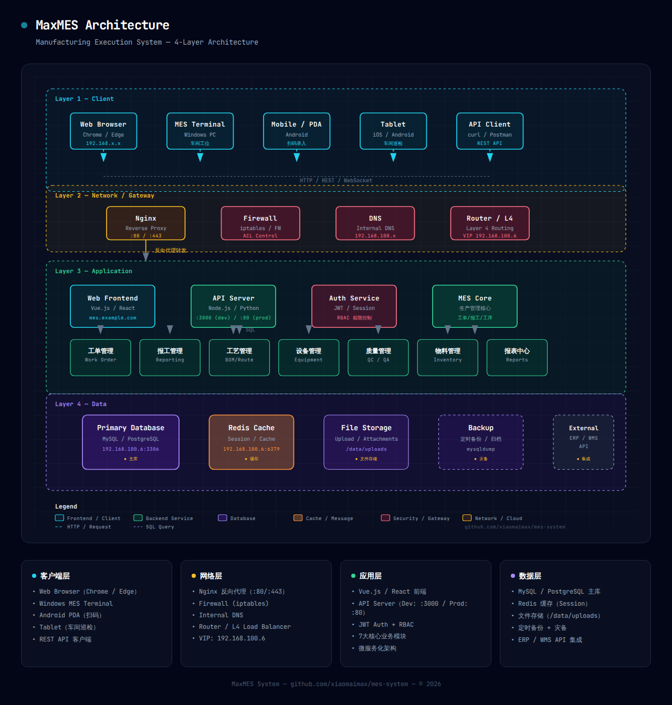

# MaxMES 系统架构设计

## 0. 架构图（4 层）

> 生成于 2026-04-25，使用 `architecture-diagram` skill（dark-themed SVG HTML）
> 源码：[raw/articles/maxmes-architecture-2026-04-25.md](../raw/articles/maxmes-architecture-2026-04-25.html)



### 分层说明

| 层 | 名称 | 核心组件 |
|----|------|---------|
| Layer 1 | 客户端层 | Web Browser / MES Terminal / PDA / Tablet / API Client |
| Layer 2 | 网络/网关层 | Nginx 反向代理 / Firewall / DNS / Router (VIP: 192.168.100.6) |
| Layer 3 | 应用层 | Vue.js 前端 / API Server / Auth (JWT+RBAC) / MES Core / 7大业务模块 |
| Layer 4 | 数据层 | MySQL 主库 / Redis 缓存 / 文件存储 / 备份 / ERP-WMS 集成 |

## 2. 技术栈选择

### 2.1 技术栈总览

| 层次 | 技术/框架 | 版本 | 用途 |
|------|-----------|------|------|
| 前端 | React | 18.x | 前端框架 |
| 前端 | TypeScript | 5.x | 类型安全 |
| 前端 | Ant Design | 5.x | UI组件库 |
| 前端 | Redux | 4.x | 状态管理 |
| 前端 | React Router | 6.x | 路由管理 |
| 后端 | Node.js | 18.x | 后端运行环境 |
| 后端 | Express | 4.x | Web框架 |
| 后端 | Sequelize | 6.x | ORM框架 |
| 后端 | JWT | 8.x | 身份认证 |
| 数据库 | MySQL | 8.0 | 关系型数据库 |
| 缓存 | Redis | 7.x | 缓存 |
| 消息队列 | RabbitMQ | 3.12.x | 异步消息处理 |

## 7. 部署架构

### 7.1 本地部署架构

服务器: `192.168.100.6`（Ubuntu@PVE）

**1Panel 服务面板**：
- 外部地址: `http://39.182.12.35:17620/xiaomai`
- 内部地址: `http://192.168.100.6:17620/xiaomai`
- 面板用户: `admin` / 密码: `xiaomai@2015`

**系统运行账户**: `Liumin` / `x@`

**Docker 部署组件**: MYSQL / Redis

### 7.2 集成接口

| 系统 | 集成方式 | 接口类型 | 数据流向 |
|------|----------|----------|----------|
| ERP | RESTful API | HTTP/HTTPS | 双向 |
| WMS | RESTful API | HTTP/HTTPS | 双向 |
| PLM | RESTful API | HTTP/HTTPS | 单向（PLM→MES） |
| 设备 | MQTT/OPC UA | TCP | 单向（设备→MES） |
| SCADA | OPC UA | TCP | 双向 |

## 9. 性能架构

### 9.1 性能优化策略

| 优化层次 | 优化策略 | 实现方式 |
|----------|----------|----------|
| 前端性能 | 代码分割 | React.lazy + Suspense |
| 前端性能 | 缓存 | Service Worker + LocalStorage |
| 前端性能 | 图片优化 | 懒加载 + 压缩 |
| 后端性能 | 缓存 | Redis |
| 后端性能 | 异步处理 | RabbitMQ |
| 后端性能 | 数据库优化 | 索引 + 查询优化 |
| 后端性能 | 负载均衡 | Nginx |
| 系统性能 | 水平扩展 | Kubernetes |
| 系统性能 | 垂直扩展 | 增加资源 |

### 9.2 性能监控

详见 [[mes/operations]]

## 环境变量配置

**文件**: `/opt/mes-system/.env`

```bash
NODE_ENV=production
PORT=5002
CORS_ORIGIN=http://192.168.100.6:3000

# 数据库配置
DB_HOST=192.168.100.6
DB_PORT=3306
DB_NAME=mes_system
DB_USER=mes_user
DB_PASSWORD=***

# Redis 配置
REDIS_URL=redis://:redis@192.168.100.6:6379

# JWT 配置
JWT_SECRET=***
JWT_EXPIRE=7d

# 日志配置
LOG_LEVEL=info

# 监控配置
SLOW_QUERY_THRESHOLD=1000
ENABLE_MONITORING=true
```

**关键端点**:
- 健康检查: `http://192.168.100.6:5002/api/health`
- 监控面板: `http://192.168.100.6:5002/api/monitor/metrics`
- 缓存统计: `http://192.168.100.6:5002/api/monitor/cache/stats`

## 数采最佳实践

**MES数采架构**:
```
PLC → 边缘网关 → MQTT Broker → MES消息队列 (RabbitMQ) → MES服务器集群 → 可视化/告警
```

**科强绍兴数采架构**:
```
PLC → [采集代理] → Redis集群或RabbitMQ集群（注塑机） → SQL Server集群 → MES服务器集群 → 可视化/告警
```

## 相关页面
- [[mes/index]] — MaxMES 知识库总览
- [[mes/database]] — 数据库设计
- [[mes/deployment]] — 部署手册
- [[mes/operations]] — 运维手册
